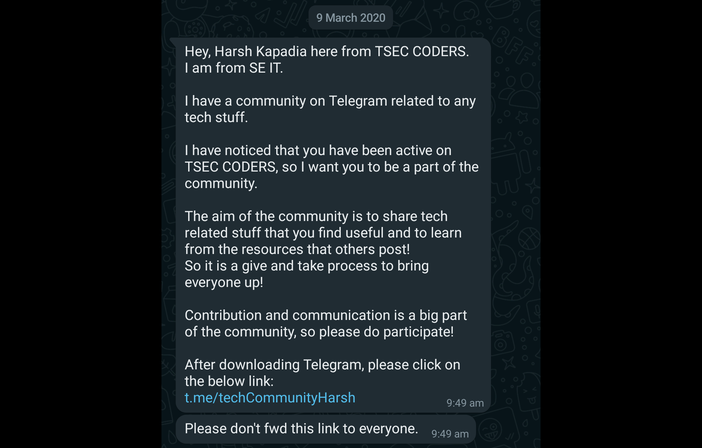
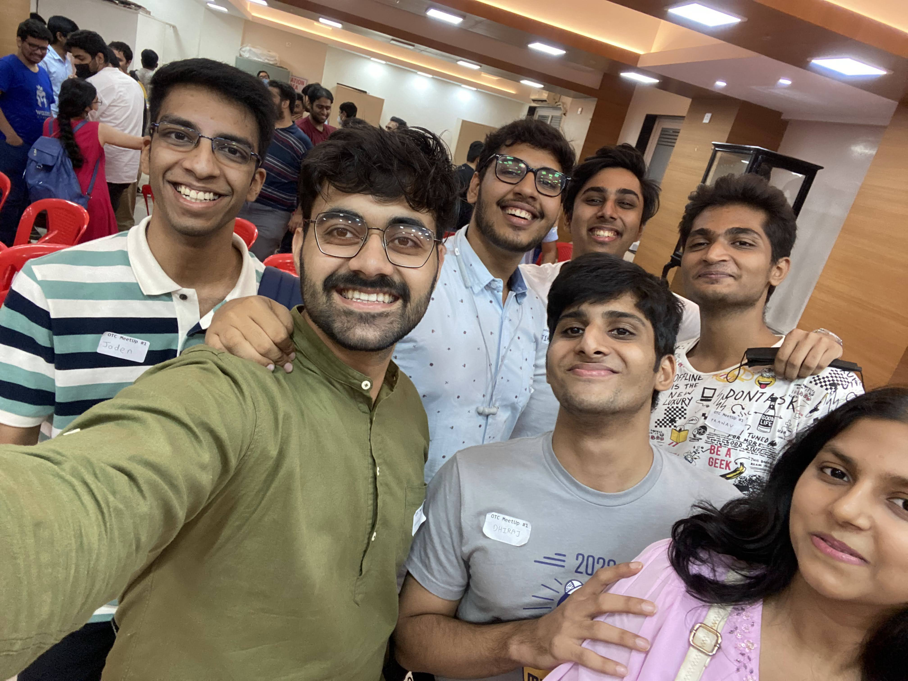
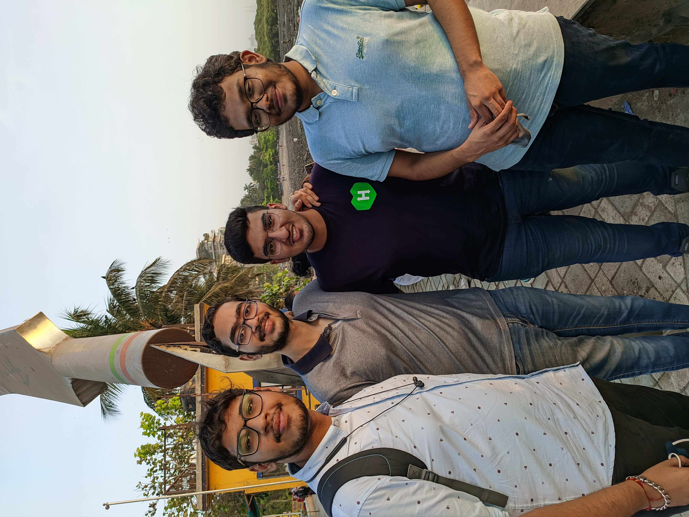
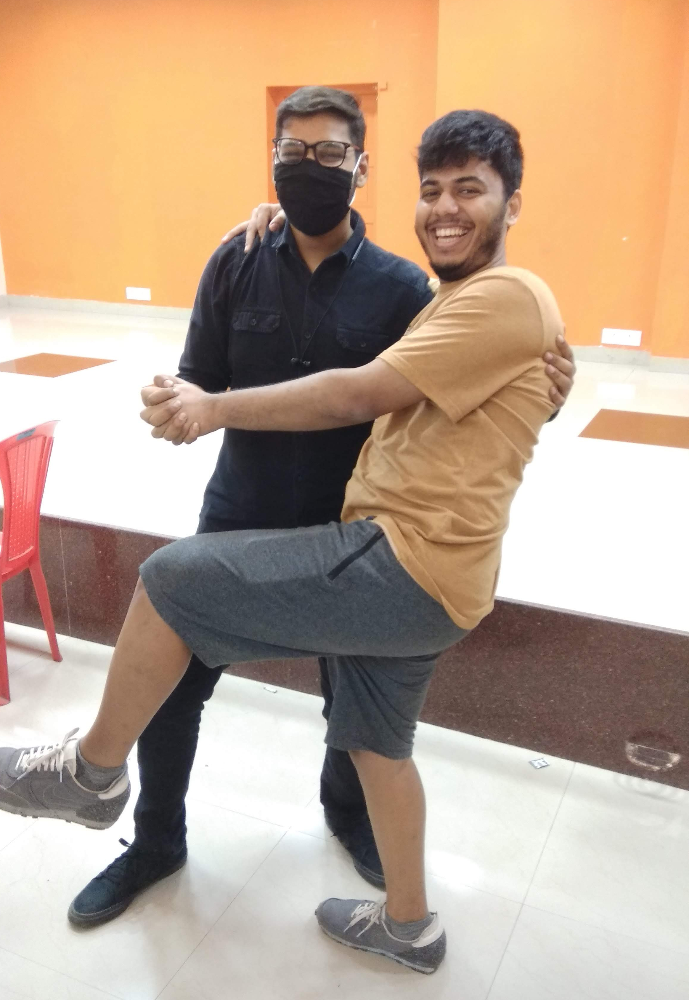
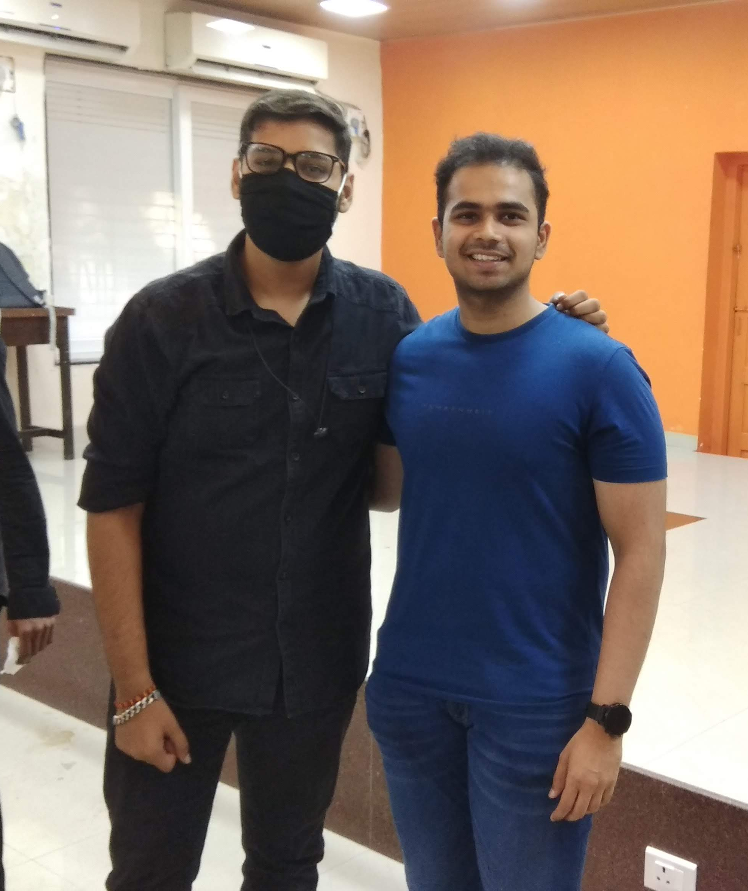
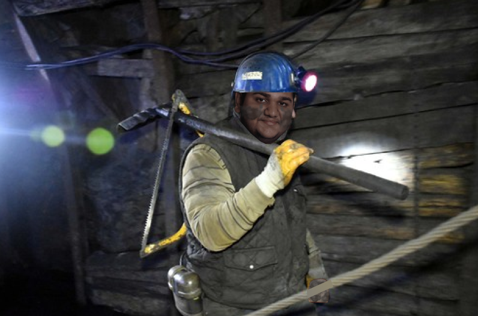

# Introduction

If you don't know what **[Our Tech Community (OTC)](https://ourtech.community)** is, here is a TL;DR for you: It is an **open-for-all**, **fun-loving** tech community founded by [Harsh Kapadia](https://links.harshkapadia.me). You can look at all the [links](https://links.ourtech.community) and join our [Telegram group](https://t.me/OurTechComm) and catch up with us every Saturday OTC catchup call at 10:30 PM IST.

# How do I join in?

A lot of you might not know that OTC was an invite-only community in its initial days and I was invited by Harsh.

> Yes it was just "Tech Community" I guess I gave the idea for adding "Our" (I don't remember😅)

It was my first year getting an invitation from a senior for such _**Elite Club**_ and I was so happy because of this message. I still remember that I was boasting about it in front of all my friends.

It was my **first community** and for a long time, I didn't know what it meant. But later I got to know about meet-ups and other communities by Harsh.

# How it has impacted me?

OTC has become a very important piece of my life. It is an amazing journey and I'm happy that I enjoyed it to the fullest. From making memes to learning things we have completed 90+ catchups.

## The lockdown time (How CatchUp started)

Like some other amazing things in this world CatchUp started with the **small idea** of having something to vent out after a busy day and just relax.

It started when we were in a meeting with a small group of friends and someone said "Why not do it more often?" and Harsh went like why not 🤷‍♂️

And kids "That's how CatchUps were started"

It was that time when I, [Dheeraj](https://twitter.com/DhiruCodes/) and [Kartik](https://twitter.com/KartikSoneji_) started **helping** Harsh and eventually became **Admins** at OTC.



> Cannot find 1st CatchUp image 😅 (probably it never existed) and Yes we used [Jitsi](https://meet.jit.si) 🙃

## Friends for life ❤️

Friends are one of the most important things in my life, and yes, I'm a bit possessive about them. CatchUp gave me a lot of friends like [Himanshu Sharma](https://twitter.com/_SharmaHimanshu), [Ishan Sharma](https://twitter.com/ishandeveloper), [Jai Dewani](https://twitter.com/jai_dewani), [Aditya Oberai](https://twitter.com/adityaoberai1), [Sreekaran](https://twitter.com/skxrxn), [Ayush Pal](https://twitter.com/pal_codes), [Preet Parekh](https://twitter.com/TmPreet), [Rishit Dagli](https://twitter.com/rishit_dagli) and many more (Sorry I'm too lazy to type out all names, but you know you are in my ❤️)

These folks not only taught me but we did a lot of fun things together (like roasting Harsh) and meeting them IRL was so much more fun!

|                                               |                                                    |
| --------------------------------------------- | -------------------------------------------------- |
|  |             |
|        |  |

> We need to take photos together [Aditya Oberai](https://twitter.com/adityaoberai1) and [Rishit Dagli](https://twitter.com/rishit_dagli)!!

> Hope I can meet [Jai Dewani](https://twitter.com/jai_dewani) and [Sreekaran](https://twitter.com/skxrxn) soon 🥺

## For career

It helped me with dealing with all my **dilemmas** like 'What should I do if I don't want to continue to code in the future?' or 'Which companies should I join?' and god knows what other things.

Also, I almost learned web dev because of CatchUps. Hopefully will also learn AI/ML someday @Rishit👀

# The fun things

The best part of being part of a community is that you get to meet a lot of people. I like to talk to new people and connect with them, so naturally, meetups and catchups were my favorite part.

A few months ago, we had our 1st [MeetUp](https://meetup.ourtech.community/) (very thoughtful naming scheme)



---

How can we forget the amazing art made by [Ishan Sharma](https://twitter.com/ishandeveloper)? It was such an amazing CatchUp

> I'm not going to tell the context here 🙃

# Some serious things

As we all know everything is not sunshine and rainbows. Recently a lot of things came by and we need to focus on a few things as a team and make some important decisions.

Also, I became Organizer, after becoming Organizer I got to know a lot of things which never thought of earlier. I'm dealing with it at my own pace and I'm sure I will be able to handle it but there are a lot of tough decisions to be made and things to think about before doing anything. Everything will be fine after all I have my OTC family with me.

---



# Outro

Thanks a lot, everyone for being there and supporting us. Thanks, Harsh for starting this amazing community!

Hasta La Vista, take care and be happy!
