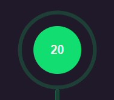
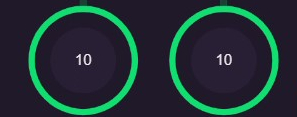
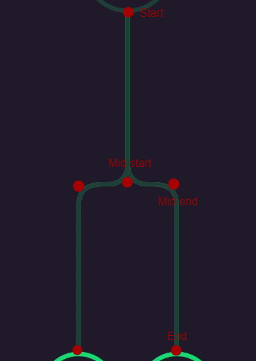
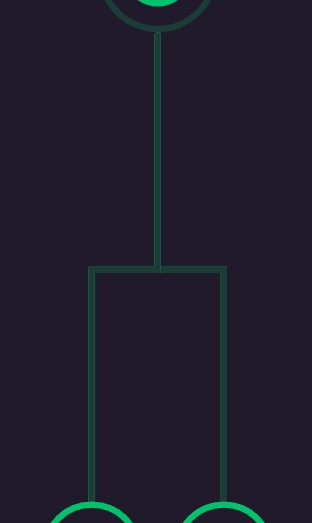
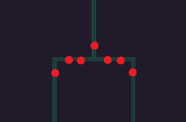

Hey everyone! 👋

Sorry for being lazy but I'm back (at least for now 😉).

Ok back to Flutter and Animations, two of my favourite things in frontend development.



<center>
  <video width="50%" autoplay loop>
    <source src="./videos/animation-full.mp4" type="video/mp4">
    Full
  </video>
</center>



Last year when I was still interning at a company I was asked to build the above animation. It was an interesting but a bit difficult task as the animation had a lot of moving parts and the data inside (amount) will change, hence I cannot use a video or something like that and video would take more space than code. Let me take you through my thought process of building this.

Whenever I think about building an animation I look at this amazing chart by the Flutter team.

[](https://docs.flutter.dev/ui/animations)

By looking at this chart you can see that our animation is basically lines and nodes. So it looks like a drawing and I thought it's easy to code it (boy I was so wrong 🥲). Hence I picked CustomPainter.

Before I go ahead I would like to mention that you can also create a [RenderObject](https://api.flutter.dev/flutter/rendering/RenderObject-class.html) in Flutter if you want any of the element to be clickable or have elements which are complex to build with CustomPainter but easier using existing widgets.

Moving on to the how I built this animation -

1. Build the static components without any animations.
1. Divide the animation is parts and animate them.
1. Optimize the animation.

### Create static components

When I saw the end state of animation I divided it in 3 sections to focus on.



1. Red - Main node
1. Blue - edge lines
1. Yellow - Children nodes

Now that we thought about how we are going to split our components, now we can start creating static components. We should also keep in mind that we need to animate these components so just ensure than you use a variables such that it becomes easier to animate it later.

```dart
// Some constants
const _roundedRectangleRadius = 25.0;
const _padding = 15.0;

const Color darkGreen = Color(0xff1B3C37),
    green = Color(0xff01C36D),
    text = Color(0xffEBECEC),
    primary = Color(0xff2A2136);

// The CustomPainter (where Flutter devs are artists)
class TreeSplitAnimationPainter extends CustomPainter {

  // Getters for paints
  Paint get darkGreenPaint => Paint()
    ..color = darkGreen
    ..strokeWidth = 5
    ..style = PaintingStyle.stroke
    ..strokeCap = StrokeCap.round;

  Paint get greenPaint => Paint()
    ..color = green
    ..strokeWidth = 5
    ..style = PaintingStyle.stroke
    ..strokeCap = StrokeCap.round;

  // Here we need to write our code which will draw stuff on canvas
  @override
  void paint(Canvas canvas, Size size) {
    // Sizes of outlines and nodes
    final rootNodeRadius = size.width / 10;
    final outlineRootNodeRadius = rootNodeRadius + 18;
    final nodeRadius = size.width / 12;
    final outlineNodeRadius = nodeRadius + 15;

    // Painting starts here
  }
}
```

After setting up stuff we can move on to the more interesting part, that is painting on canvas.

Let's start with making the nodes as it's easier and canvas has built in methods for them. We will use [Canvas API](https://api.flutter.dev/flutter/dart-ui/Canvas-class.html) a lot after this.

#### Making nodes

|                                                    |                                                             |
| -------------------------------------------------- | ----------------------------------------------------------- |
|  |  |

When you look at them you can see a filled cicle and an outlined circle. Ignore the connecting edge lines we will get back to it in next section.

For the circles we can use [Canvas.drawCircle](https://api.flutter.dev/flutter/dart-ui/Canvas/drawCircle.html) by giving it the center, radius and style.

```dart
canvas.drawCircle(center, nodeRadius, circlePaint);
```

Now we can either draw the outline using the same `drawCircle` method and set it to not fill the colors but we need to animate it hence we will use another method called [Canvas.drawArc](https://api.flutter.dev/flutter/dart-ui/Canvas/drawArc.html)

```dart
canvas.drawArc(
  Rect.fromCircle(center: center, radius: radius), // creates a box in which the circle is formed
  startAngle,         // starting point of arc
  sweepAngle,         // end point of arc
  false,              // `useCenter` = false we don't want to start and end at center
  paint,              // painting instructions
);
```

Don't get scared this feels easier when you start actually doing it.

Now you can use these and make a function to build your node!

```dart
void _paintNode({
  required Canvas canvas,             // thing that will paint
  required Offset center,             // obvi
  required double nodeRadius,         // obvi
  required double outlineNodeRadius,  // obvi
  required double startAngle,         // start angle of the arc
  required Paint circlePaint,         // instructions to paint your circle
  required Paint outlinePaint,        // outline painting instructions
}) {
  canvas.drawCircle(center, nodeRadius, circlePaint);

  _paintOutlineCircle(
    canvas: canvas,
    startAngle: startAngle,
    sweepAngle: math.pi * 2,
    paint: outlinePaint,
    radius: outlineNodeRadius,
    center: center,
  );
}
```

We will place our nodes later but it will work just perfectly fine. (trust me bro 🙃)

#### Making edge lines



Now we are at the most difficult yet interesting section. To create we can use [Canvas.drawLine](https://api.flutter.dev/flutter/dart-ui/Canvas/drawLine.html) for straight lines or [Canvas.drawPath](https://api.flutter.dev/flutter/dart-ui/Canvas/drawPath.html) to define path and then ask it to draw, basically have a pen and draw on canvas.

By looking at the curves we now that we have to use `drawPath` method.

```dart
canvas.drawPath(path, paint);
```

It simply takes `path` and `paint` as input but defining `path` is most complicated.

By looking at the lines we can see that it starts at the same point and then splits in middle then moves in either directions and then ends. We can conclude that we need start, and end points and derive middle start and middle end point from them.

```
mid       =   YofStart + (distance between start and end along Y-axis) / 2
midStart  =   (XofStart, mid)
midEnd    =   (XofEnd, mid)
```

This roughly translates to

```dart
// calculate the point where the line would split
final mid = edgeStart.dy + ((edgeEnd.dy - edgeStart.dy) / 2);
// point where it start to move left/right
final edgeMidStart = Offset(edgeStart.dx, mid);
// point where it start to move down again
final edgeMidEnd = Offset(edgeEnd.dx, mid);
```

Ahh... we can finally create our lines as we have everything we need, now we can jump into [Path APIs](https://api.flutter.dev/flutter/dart-ui/Path-class.html). Think it as we are drawing with a pen.

We need to move our pen to the starting point

```dart
path.moveTo(edgeStart.dx, edgeStart.dy)
```

Then move to the mid start point while drawing a line

```dart
path.lineTo(edgeMidStart.dx, edgeMidStart.dy)
```

Then draw till the mid end point

```dart
path.lineTo(edgeMidEnd.dx, edgeMidEnd.dy)
```

Then finally we can end at end point

```dart
path.lineTo(edgeEnd.dx, edgeEnd.dy)
```

Looks simple enough? You can write it using [cascade operator](https://dart.dev/language/operators#cascade-notation) in Dart.

```dart
final edgePath = Path()
  // start
  ..moveTo(edgeStart.dx, edgeStart.dy)
  // to mid start
  ..lineTo(edgeMidStart.dx, edgeMidStart.dy)
  // to mid end
  ..lineTo(edgeMidEnd.dx, edgeMidEnd.dy)
  // to end
  ..lineTo(edgeEnd.dx, edgeEnd.dy);
```

Now it looks more readable as well and we have something that looks like this...



Looks good but we can do better, lets add those curves.

Whenever you see a curve you can draw them with a [Bézier curve](https://en.wikipedia.org/wiki/B%C3%A9zier_curve). For this case we are going to use [Quadratic Bézier curves](https://en.wikipedia.org/wiki/B%C3%A9zier_curve#:~:text=Quadratic%20B%C3%A9zier%20curves%5Bedit%5D).



Flutter has [Path.quadraticBezierTo](https://api.flutter.dev/flutter/dart-ui/Path/quadraticBezierTo.html) which take two co-ordinate points - control and end point. It starts with the last point to the end point controlled by a control point.

So the plan it to start a bit before the actual line ends and start before the actual line starts.



We can see that we need to -

- Start curve 1 before just before we reach _mid start_ and end it before we reach _mid end_
- Start curve 2 before just before we reach _mid end_ and end it just after _mid end_

Our code should look like -

```dart
final edgePath = Path()
  // start
  ..moveTo(edgeStart.dx, edgeStart.dy)
  // to mid start
  ..lineTo(edgeMidStart.dx, edgeMidStart.dy)  // early end this
  // to mid end
  // *curve 1 here*
  ..lineTo(edgeMidEnd.dx, edgeMidEnd.dy)      // late start and early end this
  // to end
  // *curve 2 here*
  ..lineTo(edgeEnd.dx, edgeEnd.dy);           // late start this
```

In flutter `quadraticBezierTo` takes 4 parameters.

```dart
path.quadraticBezierTo(
  controlX,
  controlY,
  endX,
  endY,
)
```

I know, I also hate this API.

```dart
final edgePath = Path()
  ..moveTo(edgeStart.dx, edgeStart.dy)
  ..lineTo(
    edgeMidStart.dx,
    edgeMidStart.dy - _roundedRectangleRadius,  // early end
  )
  ..quadraticBezierTo(
    edgeMidStart.dx,
    edgeMidStart.dy,
    edgeMidStart.dx + _roundedRectangleRadius,  // late start
    edgeMidStart.dy,
  )
  ..lineTo(
    edgeMidEnd.dx -_roundedRectangleRadius,     // early end
    edgeMidEnd.dy,
  )
  ..quadraticBezierTo(
    edgeMidEnd.dx,
    edgeMidEnd.dy,
    edgeMidEnd.dx,
    edgeMidEnd.dy + _roundedRectangleRadius,    // late start
  )
  ..lineTo(
    edgeEnd.dx,
    edgeEnd.dy,
  );
```

This will give you just the right side to get left side you just need to modify a few things.

```dart
final edgePath = Path()
...
  ..quadraticBezierTo(
    edgeMidStart.dx,
    edgeMidStart.dy,
+   edgeMidStart.dx + (isLeft ? -_roundedRectangleRadius : _roundedRectangleRadius),
-   edgeMidStart.dx + _roundedRectangleRadius,
    edgeMidStart.dy,
  )
  ..lineTo(
+   edgeMidEnd.dx - (isLeft ? _roundedRectangleRadius : -_roundedRectangleRadius),
-   edgeMidEnd.dx -_roundedRectangleRadius,
    edgeMidEnd.dy,
  )
...
```

Finally we can paint it using our `drawPath` method on `Path`.

```dart
canvas.drawPath(edgePath, greenPaint);
```

Creating a method for this would look like -

```dart
void _paintEdge({
  required Canvas canvas,
  required Offset edgeStart,
  required Offset edgeEnd,
  bool isLeft = false,
}) {
  // calculate the point where the line would split
  final mid = edgeStart.dy + ((edgeEnd.dy - edgeStart.dy) / 2);
  // point where it start to move left/right
  final edgeMidStart = Offset(edgeStart.dx, mid);
  // point where it start to move down again
  final edgeMidEnd = Offset(edgeEnd.dx, mid);

  final edgePath = Path()
    // Move to the starting point
    ..moveTo(edgeStart.dx, edgeStart.dy)
    // Make a straight line to the mid leaving space for curve
    ..lineTo(
      edgeMidStart.dx,
      edgeMidStart.dy - _roundedRectangleRadius,
    )
    // the curve
    ..quadraticBezierTo(
      edgeMidStart.dx,
      edgeMidStart.dy,
      edgeMidStart.dx + (isLeft ? -_roundedRectangleRadius : _roundedRectangleRadius),
      edgeMidStart.dy,
    )
    // Line which moves horizontally again leaving space for curve
    ..lineTo(
      edgeMidEnd.dx + (isLeft ? _roundedRectangleRadius : -_roundedRectangleRadius),
      edgeMidEnd.dy,
    )
    // Another curve
    ..quadraticBezierTo(
      edgeMidEnd.dx,
      edgeMidEnd.dy,
      edgeMidEnd.dx,
      edgeMidEnd.dy + _roundedRectangleRadius,
    )
    // Stretch line to the end
    ..lineTo(
      edgeEnd.dx,
      edgeEnd.dy,
    );

  // Paint the base dark green color
  canvas.drawPath(edgePath, darkGreenPaint);
}
```

#### Placing the components

For simplicity of code I'm moving the canvas center from top left to top center by the [Canvas.translate](https://api.flutter.dev/flutter/dart-ui/Canvas/translate.html)

Let's take our main node as the reference point to so that things makes sense.

It will be a bit below the top center hence the following code -

```dart
@override
void paint(Canvas canvas, Size size) {
  ...

  // Center canvas horizontally as it becomes easier to make all measurements
  canvas.translate(size.width / 2, 0);

  // Point where you want the root node to be at end (top-center)
  final start = Offset(0, outlineRootNodeRadius);

  _paintNode(
    canvas: canvas,
    center: start,
    nodeRadius: rootNodeRadius,
    outlineNodeRadius: outlineRootNodeRadius,
    startAngle: math.pi / 2,
    sweepAngle: math.pi * 2,
    circlePaint: Paint()..color = green,
    initialOutlinePaint: darkGreenPaint..color = darkGreen,
    sweepOutlinePaint: greenPaint..color = green,
  );

  ...
}
```

```dart
@override
void paint(Canvas canvas, Size size) {
  ...

  // Start point of edge
  final edgeStart = start + Offset(0, outlineRootNodeRadius);

  // Note: we will calculate only for right node and for left we will negate it

  // end point of the edge
  final edgeEnd = edgeStart +
      Offset(
        // adding padding to have distance between 2 children
        outlineNodeRadius + _padding,
        // how much space child will need from the bottom
        size.height - (outlineNodeRadius * 2) - edgeStart.dy - _padding,
      );

  // position of child node
  final childNode = edgeEnd + Offset(0, outlineNodeRadius);

  // Right edge
  _paintEdge(
    canvas: canvas,
    edgeStart: edgeStart,
    edgeEnd: edgeEnd,
  );
  _paintNode(
    canvas: canvas,
    center: childNode,
    nodeRadius: nodeRadius,
    outlineNodeRadius: outlineNodeRadius,
    startAngle: -math.pi / 2,
    sweepAngle: math.pi * 2,
    circlePaint: Paint()..color = primary,
    initialOutlinePaint: darkGreenPaint,
    sweepOutlinePaint: greenPaint,
  );

  // Left edge
  _paintEdge(
    canvas: canvas,
    edgeStart: edgeStart,
    edgeEnd: edgeEnd.scale(-1, 1),          // negate on x-axis
    isLeft: true,
  );
  _paintNode(
    canvas: canvas,
    center: childNode.scale(-1, 1),         // negate on x-axis
    nodeRadius: nodeRadius,
    outlineNodeRadius: outlineNodeRadius,
    startAngle: -math.pi / 2,
    sweepAngle: math.pi * 2,
    circlePaint: Paint()..color = primary,
    initialOutlinePaint: darkGreenPaint,
    sweepOutlinePaint: greenPaint,
  );
}
```

Finally after sooooo much efforts we are able to create a static painting on our canvas.

Now we can move to the more difficult part that is animating it.

### Divide the animation is parts and animate them

While having working on animating the components we need to look at the bigger picture and think in terms of when the animation starts and when it ends and how it is connected to each other.

Before we write code it's always better to plan how we are going to do it, as it will make it a lot easier for you to code it and more importantly understand it.

You can divide when the direction of motion, color, or focus (Object which is animating) of animation changes.

> Trust your gut feeling.

#### Tracking Main node's motion



<center>
  <video width="50%" autoplay loop>
    <source src="./videos/animation-1.mp4" type="video/mp4">
    Full
  </video>
</center>



We just need move the center of our main node from center of the screen to the main position where it should be

```dart
@override
void paint(Canvas canvas, Size size) {
  ...

  // Point where you want the root node to be at end (top-center)
  final start = Offset(0, outlineRootNodeRadius);

  // Get center of the screen
  final center = Offset(0, size.height / 2);

  // Paint main node
  _paintNode(
    canvas: canvas,
    center: lerpOffset(center, start, moveRootToTop.value),
    nodeRadius: rootNodeRadius,
    ...
  );

  ...
}
```

`lerpOffset` will move our node from `center` to `start` while we can control the percent of movement with `moveRootToTop.value`

#### edge lines appear



<center>
  <video width="50%" autoplay loop>
    <source src="./videos/animation-2.mp4" type="video/mp4">
    Full
  </video>
</center>



The edge lines appear and shifts attention of the user from main head to it. It's very easy, just change opacity from 0 to 1.

For this we will just update our `darkGreenPaint` getter to have color with an opacity to it.

```dart
Paint get darkGreenPaint => Paint()
  ..color = darkGreen.withOpacity(fadeInEdge.value)
  ..strokeWidth = 5
  ..style = PaintingStyle.stroke
  ..strokeCap = StrokeCap.round;
```

We can control the fade in of this with `fadeInEdge.value`.

#### Green color flows from main node to edge lines



<center>
  <video width="50%" autoplay loop>
    <source src="./videos/animation-3.mp4" type="video/mp4">
    Full
  </video>
</center>



We can see that the color from the outline of main node decreases, to make this we can use `sweepAngle` and decrease it. Before that to make it easier we can have green color outline stacked on dark green color outline by updating our `_paintNode` method.

```dart
void _paintNode({
  ...
  required double startAngle,
  required double sweepAngle,
  required Paint circlePaint,
  required Paint initialOutlinePaint,
  required Paint sweepOutlinePaint,
}) {
  ...

  _paintOutlineCircle(
   ...
    paint: initialOutlinePaint,
  );

  _paintOutlineCircle(
    canvas: canvas,
    startAngle: startAngle,
    sweepAngle: sweepAngle,
    paint: sweepOutlinePaint,
    radius: outlineNodeRadius,
    center: center,
  );
}
```

Things changed here are that we have sweep angle and 2 paint for outline - initial and sweep

For main node the sweep angle decreases, (i.e. 2π to 0) by changing the calling function

```dart
_paintNode(
  ...
  startAngle: math.pi / 2,
  sweepAngle: lerpDouble(math.pi * 2, 0, edgeFill.value)!,
  initialOutlinePaint: darkGreenPaint..color = darkGreen,
  sweepOutlinePaint: greenPaint..color = green,
);
```

`lerpDouble(math.pi * 2, 0, edgeFill.value)` will move from 2π to 0 controlled by `edgeFill.value`.

While it's decreasing we also need to fill the edge lines. Animating lines and curves but I found a neat trick to do this on [stackoverflow](https://stackoverflow.com/a/57233047/13268307) by [andras](https://stackoverflow.com/users/4420543/andras).

Over here they divided the given path into segments and add it to the path till the specified percentage is reached.

We can use `createAnimatedPath` function to get the desired animation. Again we will stack it on the dark green color.

```dart
void _paintEdge({
  ...
}) {
  ...
  // Paint the base dark green color
  canvas.drawPath(edgePath, darkGreenPaint);

  if (edgeFill.value != 0)
    // Paint the green color which comes in 3rd section
    canvas.drawPath(
      createAnimatedPath(edgePath, edgeFill.value),
      greenPaint,
    );
}
```

`edgeFill.value` here increases the value from 0 to 1 increasing the color filled in edge lines.

Noticed that the whole animation is controlled by `edgeFill.value`, it decreased the value for main node outline while increased the color in edge lines.

#### Green color flows from edge lines to children



<center>
  <video width="50%" autoplay loop>
    <source src="./videos/animation-4.mp4" type="video/mp4">
    Full
  </video>
</center>



This is exact opposite of what we did in previous step. The edge lines decrease and children node outline increases.

Like the question ['Is the glass half empty or half full?'](https://en.wikipedia.org/wiki/Is_the_glass_half_empty_or_half_full%3F) we can say that the edge lines are filling with dark green color instead of draining dark green color as it's a bit difficult to handle.

We will stack filling dark green color lines on the existing stack

```dart
void _paintEdge({
  ...
}) {
  ...

  if (childrenFill.value != 0)
    // Paint it again dark green for final section
    canvas.drawPath(
      createAnimatedPath(edgePath, lerpDouble(0, 1, childrenFill.value)!),
      darkGreenPaint,
    );
}
```

This is handled by `childrenFill.value` and we will use the same thing for all the animations in this section.

To fill the outline of children nodes we will increase the `sweepAngle` from 0 to 2π and fade in the circles at the same time.

```dart
_paintNode(
  ...
  startAngle: -math.pi / 2,
  sweepAngle: lerpDouble(0, 2 * math.pi, childrenFill.value)!,
  circlePaint: Paint()..color = primary.withOpacity(childrenFill.value),
  initialOutlinePaint: darkGreenPaint,
  sweepOutlinePaint: greenPaint,
);
```

#### Orchestrating these animations

You might think what are these `moveRootToTop`, `fadeInEdge`, `edgeFill`, and `childrenFill`? These are technically variables with `Animation<double>` type, I use them to orchestrate the animation. `AnimationController` while controls the animation, we can attach the controller to multiple `Animation<T>` to have finer control. Using [CurvedAnimation](https://api.flutter.dev/flutter/animation/CurvedAnimation-class.html) to have different [Curves](https://api.flutter.dev/flutter/animation/Curves-class.html) and [Interval](https://api.flutter.dev/flutter/animation/Interval-class.html) to define the interval in which the `Animation` should start and end, for example - start at 20% and end at 60% of animation duration will be written as `Interval(0.2, 0.6)`. Finally all this will be packed in a [Tween](https://api.flutter.dev/flutter/animation/Tween-class.html) where you will define the start and end value of the animation.

This will look like -

```dart
animation = Tween<double>(begin: 0, end: 1).animate(
  CurvedAnimation(
    parent: animationController,
    curve: const Interval(0.1, 0.2, curve: Curves.easeInOut),
  ),
);
```

I read it from inside out - start the animation at 10% and end it at 20% following _ease-in-out_ curve, it will be controlled by the `animationController` and the value will move from 0 to 1.

Coming back to our animation -

You can define it as late variable and then assign it in the contructor of the class.

```dart
late final Animation<double> edgeFill,
    fadeInEdge,
    fadeInChildren,
    moveRootToTop;

TreeSplitAnimationPainter({
  required AnimationController animationController,
}) {
  // Tween that moved the root node up as soon as animation starts
  moveRootToTop = Tween<double>(begin: 0, end: 1).animate(
    CurvedAnimation(
      parent: animationController,
      curve: const Interval(0, 0.2, curve: Curves.easeInOut),
    ),
  );
  // Shows the dark green colored edges
  fadeInEdge = Tween<double>(begin: 0, end: 1).animate(
    CurvedAnimation(
      parent: animationController,
      curve: const Interval(0.2, 0.3, curve: Curves.easeInOut),
    ),
  );
  // Fills the dark green colored edges with green color
  // and removes green from the outline of root node
  edgeFill = Tween<double>(begin: 0, end: 1).animate(
    CurvedAnimation(
      parent: animationController,
      curve: const Interval(0.3, 0.7, curve: Curves.easeInOut),
    ),
  );
  // Show the children nodes inside the outline
  fadeInChildren = Tween<double>(begin: 0, end: 1).animate(
    CurvedAnimation(
      parent: animationController,
      curve: const Interval(0.7, 1, curve: Curves.easeInOut),
    ),
  );
}
```

Finally we can use this custom painter in our app!! But before that I would like to suggest you some of the optimizations for the app.
