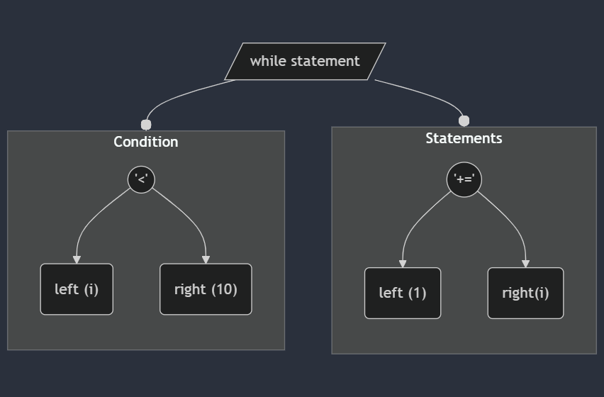

Hi readers, I recently built a programming language called AntiLang. Its main idea was to keep all the logical parts of the language the same while keeping the language logically correct and reversing it structurally.

I built this language as a fun project and I always wanted to make a language and I was bored with my day to day work and found it like an escape from it while learning a new thing.

This means that a simple FizzBuzz program would be readable but might give you a headache and make you wonder why you're reading it.

```
,20 = count let
,0 = i let

{count > i} while [
    {i % 3 == 0 && i % 5 == 0} if [
        ,{$FizzBuzz$}print
    ] {i % 3 == 0} if else [
        ,{$Fizz$}print
    ] {i % 5 == 0} if else [
        ,{$Buzz$}print
    ] else [
        ,{i}print
    ]

    ,1 += i
]
```

You can try the language using the [online interpreter](https://siruscodes.github.io/AntiLang/). (Hope it gives you a headache 🙂)

# The first draft.

```
- invert all brackets -> exchange opening n closing brackets
- all control structures are defined at the end of the block
- for )i++; i<n;0=i(
- reverse assignment
- reverse var rules (const is mutable and non-const is immutable)
- array starts from 0 to -n+1
- arg first name second
- reverse header, define, typedef
```

[Kartik Soneji](https://x.com/KartikSoneji_) and I were on an [OTC CatchUp](https://catchup.ourtech.community/) call until 3 or 4 AM, discussing the creation of a language with such a weird syntax—which resulted in this initial draft. (I'm glad I didn’t implement it all.)

The initial idea was to create a transpiler that converts this language into a C program and then passes it to GCC. We settled on the name reverse-c. Want to steal the initial draft? Go ahead!

# How I Learned About Building Languages

All programming languages are essentially structured texts written in files, serving as inputs for software such as compilers or interpreters.

These compilers and interpreters give your language its identity—you provide code, and it compiles or interprets it accordingly.

Thus, you essentially need to write either a compiler or an interpreter.

I wrote an interpreter while reading [Write an Interpreter in Go](https://interpreterbook.com/) and assumed compilers would be considerably more challenging to build. The same author later published another book called [Write a Compiler in Go](https://compilerbook.com/) (the name says it all).

I would recommend y'all to give it a read if you are **really** interested. Now let me tell you how I built AntiLang (or AntiLang interpreter).

# How the AntiLang Interpreter Works

At a high level, it follows three steps:

1. Lexer – converts text into tokens.
2. Parser – transforms tokens into an Abstract Syntax Tree (AST).
3. Evaluator – evaluates the AST (essentially running your program).

For example, consider the simple loop:

```
,0 = i let

{i < 10} while [
    ,1 += i
]
```

## The Lexer

The lexer's job is to convert this code into tokens. A token is "your code minus all the unnecessary things", i.e. all the literals, keywords, operators, and identifiers. For us, all the whitespace and newline characters are unnecessary text, but they are also tokens for languages like Python as it depends on the indents.

Each special character and operator is validated, while the rest are keywords or identifiers. The lexer processes the input character by character, returning a token for each character or group of characters.

For our first line, the tokens would be in sequence `,`, `0`, `=`, `i`, and `let` where `,` and `=` are special characters, `0` is a literal, `i` is an identifier, and `let` is a keyword.

At this stage, we don't care how the tokens are placed. `let i = 0,` is also valid as we are only concerned about all the tokens being legal.

You can have a look at the code of the lexer at [#AntiLang/src/lexer/](https://github.com/SirusCodes/AntiLang/tree/main/src/lexer).

## The Parser

At this stage, we are not concerned with how tokens are placed as we are going to build our AST.

[AST or Abstract Syntax Tree](https://en.wikipedia.org/wiki/Abstract_syntax_tree) is a tree used to represent code in a tree format.

For each feature, we need to decide on a structure.

In AntiLang, all the let statements start with a `,`, end with a `let`, between `=` and `let` we can have one and only one identifier and between `,` and `=` we can have an expression.

```
,<expression> = <identifier> let
```

An expression can be a literal or something that requires a bit of computation to generate value and an identifier is a variable.

```
,2 + 2 - 4 = zero let
```

The above example is a valid let statement with `2 + 2 - 4` as an expression and `zero` as an identifier. At this stage, we won't compute the value of the expression, we will simply create the AST and pass it to the evaluator which will do all this.

The AST of above example will look like...

<!-- https://mermaid.live/edit#pako:eNptkU1PwzAMhv9K5Mta0WrSxKkHTuOABKdxWrtDaNw1okmqxBEf0_47bgrdQOSQ2I9fO45zgtYphAq6wb21vfQknreNFbwGpHr9iCR2JAkNWlofRFneCXwfPYagnV2EiWvFmhmF-HL0cuxnJuqH6dCdRn-YBdP6RO_qPW_fDK36k325SdT3i31VwmgbQ5atylWepx6kUuzesHsRMUsxyjb_0c0vnCqmQJfd5leNQQEGvZFa8bROU6AB6nkuDVRsKulfG2jsmXUyktt92BYq8hELiKPiCW615FcZqDo5BKaoNDn_NI8__UIB3sVjvyhGaffO_WScvwBMpoOO -->


We set zero as an identifier which will hold the value of the expression which would be evaluated later.

Now that you have understood let statements I will show how _while_ is parsed.

```
{<expression>} while [ <other statements> ]
```

For _while_ we only care about the the expression (condition) between `{` and `}` and the statements between `[` and `]`. We can write some code to get an AST like this:

<!-- https://mermaid.live/edit#pako:eNpdkT1PwzAQhv-KdUsT0ap0jYCFrkxlIu5wJE5s4Y_IvqhCVf87F4eoAQ_-OD_W8-p8hSa0CirobLg0GiOJ96P0gsdFG6vqfV5EIiTllKf9Wex2QTTBtyss1xI5StLP5TR-9hEHnUlRv_JsyAR_nq-nYakoNk-bsuTXL8J2VEiwqiNRmFJCuQYzEScgml4zcXi8I2qK8s-as4j6tMROK--A7H14XsRpbT78NQ84I3f1OlsWwxacig5Ny128ThcSSLNUQsXbFuOXBOlvzOFI4fTtG6gojmoL49ByvKNBzuyWouI-hfg2_0r-nC3EMPYaqg5tYmJA_xGC-z3ffgD434qB -->



The AST for this program would look like...


```
,0 = i let

{i < 10} while [
    ,1 += i
]
```

It looks complex, right? Sure it is. I cannot tell you how many test cases I have written to cover those weird edge cases and I must say I might have missed a few.

Now that you have AST for your program you can pass it to the evaluator. But before that, I need to tell you a few things.

### How your language would follow BODMAS rule.

We understand from childhood that the value of `2 * 2 - 2` is **2** and not **0**. Because we look at it like `(2 * 2) - 2` which means we need to multiply first then subtract and not the other way around, thanks to BODMAS. I hope you all know what BODMAS is but for those who don't - It [defines the order of operation](https://www.mathsisfun.com/operation-order-bodmas.html).

But it's very difficult for computer code to understand but [Vaughan Pratt](https://en.wikipedia.org/wiki/Vaughan_Pratt) described how someone can do it. His algorithm is called Pratt Parsing or Top Down Operator Precedence.

Explaining that algorithm could be another blog, but Bob Nystrom did a great job in [Pratt Parsers: Expression Parsing Made Easy](https://journal.stuffwithstuff.com/2011/03/19/pratt-parsers-expression-parsing-made-easy/) explaining how it's done. I would urge you to implement it yourself.

### You don't need to write your own parser

Sorry I forgot to tell you that you don't need to write a parser by hand and use tools like [ANTLR](https://www.antlr.org/) which can do it for you. I didn't use it as I wanted to learn how things works and I didn't want learn how to use another tool.

But writing this parser was the most fun part as I had to find a lot of hacky ways and fight against stupid suggestions from GitHub co-pilot and whenever something clicked I got so so happy.

## The Evaluator

Finally, we pass the AST to the evaluator to run the program.

The evaluator processes each child node of the Program root node, executing your program. It also holds information about all the built-in functions and stores the values of your variables and function definitions.

In AntiLang, we leverage Go for built-in functions (for example, we pass data directly to `fmt.Println` to print it) and Go handles garbage collection, so we don't have to.

For a let statement, we simply evaluate the expression on the left-hand side and store the resulting literal in the environment.

```go
case *ast.LetStatement:
    val := Eval(node.Value, env)
    if isError(val) {
        return val
    }
    return env.Set(node.Name.Value, val)
```

Example:

```
,2 * 2 - 2 = two let
```

The value of `two` will be stored as `2`, not as `2 * 2 - 2`, because we recursively call the `Eval` function on the expression before setting it.

For a while loop, we repeatedly evaluate the condition and run the loop body until the condition becomes false.

```go
case *ast.WhileExpression:
    for {
        condition := Eval(node.Condition, env)
        if isError(condition) {
            return condition
        }

        if !isTruthy(condition) {
            break
        }

        rt := Eval(node.Body, env)
        if rt.Type() == object.RETURN_VALUE_OBJ || rt.Type() == object.ERROR_OBJ {
            return rt
        }
    }
```

Finally, to handle increments and reassignments, we first check whether the variable (identifier) exists in the environment. If it does, we perform the necessary operation and update the environment with the new value.

```go
func evalAssignExpression(name, operator string, value object.Object, env *object.Environment) object.Object {
	current, ok := env.Get(name)
    if !ok {
		return newError("identifier not found: %s", name)
	}

	switch operator {
	case "=":
		env.Set(name, value)
	case "+=":
		env.Set(name, evalInfixExpression("+", current, value))
// ...other cases...
	}
}
```

For example, consider:

```
,0 = i let

{i < 10} while [
    ,1 += i
]
```

It will first use execute the LetStatement branch and set `i` as `0`

ENV: i = 0

Then it will execute the WhileExpression branch and check of condition which is `true` as _0 < 10_ and then it will execute which will body which adds 1 to `i`. Our `evalAssignExpression` methods handles this case and updates the environment.

ENV: i = 1

This goes till `i` is set to `9` at which condition is **no longer** `true`. Then it will return control back to the program node which checks of next statement to execute.

As there is non, it will exist the program.

# What are my learnings?

I've learned a ton from this project. It's my first major project built with Go, which is also my first programming language.

Most importantly, while developing the parser, I learned that if something isn't working, it's best not to dwell on the issue. Instead, taking a break, getting some fresh air, and returning to the problem with a clear mind is much more effective.

I also learned how to compile the interpreter to [WebAssembly (WASM)](https://webassembly.org/). A key challenge was figuring out how to access the _standard out_ within the browser environment, so that printed results from AntiLang could be displayed. That was a learning curve in itself.

Write a grammar for syntax highlighting a new language using the [Monaco editor](https://microsoft.github.io/monaco-editor/) was another big ball game. I had no idea if something like this existed, even though it's something that powers VSCode and I use it every day. It was fascinating to see how syntax highlighting actually works under the hood. These two learnings are substantial enough for their own blog posts, which I plan to write in the coming weeks and will link here.

This project has given me a deep appreciation for the complexity of language development. Even this simple, unoptimized language took a month to build. I have immense respect for those who work on compilers and interpreters.

---

So, there you have it – a peek into the weird and wonderful world of AntiLang. Building it was a rollercoaster, from those late-night brainstorming sessions to wrestling with the parser (and occasionally, GitHub Copilot's "helpful" suggestions). It's wild to think how much goes into even a simple language like this. Honestly, if you're even remotely curious about compilers or interpreters, dive in. You'll learn a ton, and maybe even get a few headaches along the way. And hey, if you ever decide to build your own crazy language, drop me a line. I'd love to see what you come up with.
