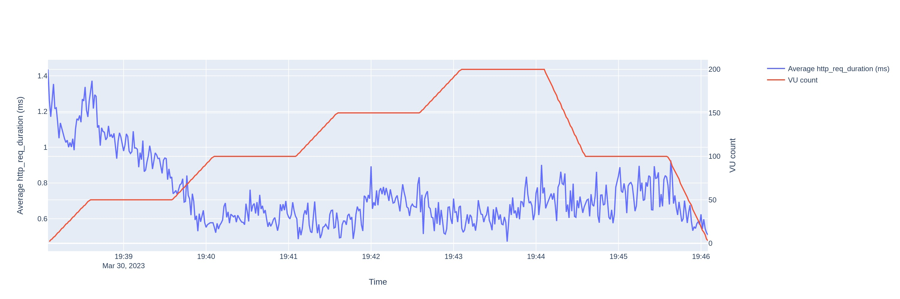
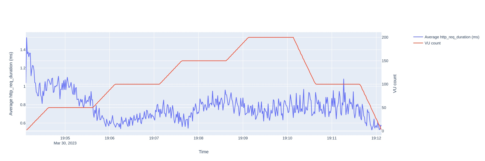
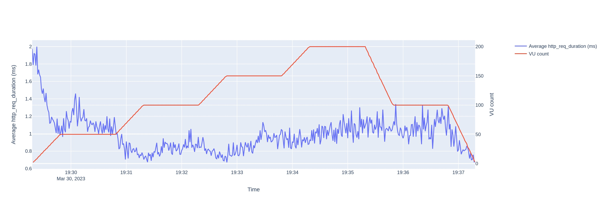
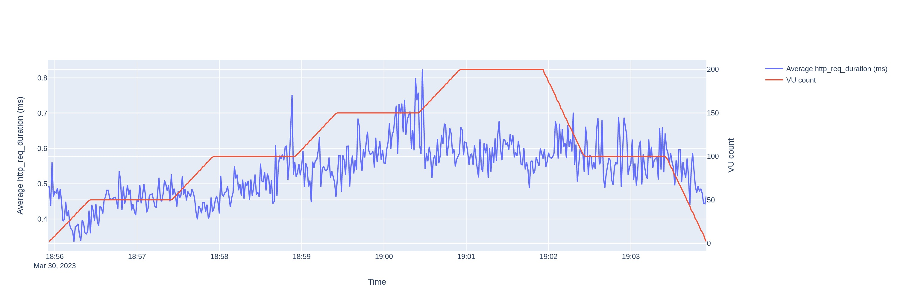
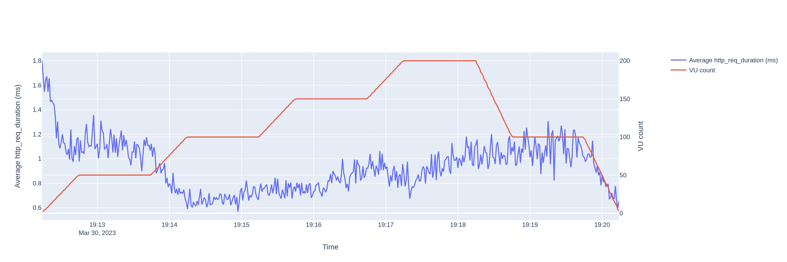
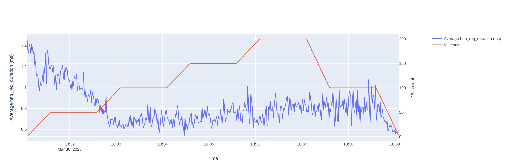
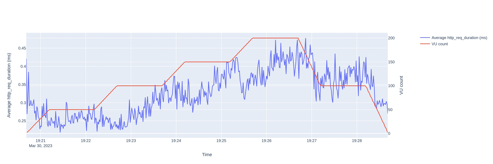
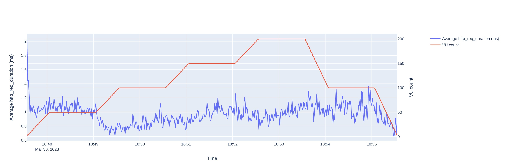
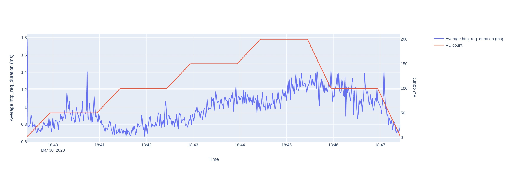

Hey everyone!

This is the second edition of Server-side Dart. I would recommend reading the [first edition](https://blog.darshanrander.com/posts/tech/serverside-dart/) before this. But if you are lazy like me TL;DR - Dart servers are slow in multipart requests and JSON parsing.

In this edition, I have included a few more frameworks, updates to the [SirusCodes/backend_benchmark](https://github.com/SirusCodes/backend_benchmark) repository and some load testing.

In this blog, I have compared the following frameworks:

- Dart
  - [Conduit](https://www.theconduit.dev/) (v4.3.6)
  - [Shelf](https://pub.dev/packages/shelf/) (v1.4.0)
  - [dart_frog](https://dartfrog.vgv.dev/) (v0.3.4)
  - [dia](https://pub.dev/packages/dia) (v0.1.3)
  - [minerva](https://pub.dev/packages/minerva/) (v0.3.3)
  - [spry](https://spry.fun/) (v0.4.0)
- Go
  - [fiber](https://gofiber.io) (v2.42.0)
- Python
  - [Flask](https://flask.palletsprojects.com/en/2.2.x/) (v2.2.2)
- Node
  - [Express](https://expressjs.com/) (v4.18.2)

# Benchmarks

The code for the benchmarks is at [SirusCodes/backend_benchmark](https://github.com/SirusCodes/backend_benchmark). Please [open an issue](https://github.com/SirusCodes/backend_benchmark/issues/new) if you find any issues in the benchmarks.

I got the below results by running the benchmark and servers on GitHub Actions.

## Custom benchmarks

The benchmarks are testing backends on 4 bases

1. Synchronous request handling
2. Asynchronous request handling
3. Multi-part requests (File upload)
4. JSON parsing

> _Lesser means better_

These show a similar pattern to the [first edition](https://blog.darshanrander.com/posts/tech/serverside-dart/#benchmarks), the only difference here we have a few more frameworks.

|                                                                                                                        |                                                                                                               |
| ---------------------------------------------------------------------------------------------------------------------- | ------------------------------------------------------------------------------------------------------------- |
|                          |  |
|        |           |
|  |                                                                                                               |

This time as well Dart Frameworks have some scope for improvement in JSON parsing and Multipart file requests.

## Load testing

For load testing, I have used [k6](https://k6.io), which is a load-testing tool that can simulate users on an endpoint.

You can have a look at the [config file](https://github.com/SirusCodes/backend_benchmark/blob/main/scripts/k6_load_testing.js) on how it works.

A **TL;DR** would be it simulates the user increasing from 0 to 50, staying there for a minute then increasing to 100 and so on till it reaches 200 in step 50 and then decreases in step 100 till it reaches 0.

In the graphs below the _**Red line**_, represents the number of **virtual/simulated users** and the _**Blue line**_, represents the **Average round trip time (ms)** on the **Y-axes** and the **time for test** on **X-axis**.

### Conduit (Dart)



RTT starts at 1.2ms and drops to 0.5ms when VUs(Virtual users) reach 100 and stays around 0.5ms and 0.8ms till the end.

### Dia (Dart)



Similar to conduit it start around 1.4ms and drops to 0.5ms at 100 VUs then maintains a steady 0.8ms RTT till the end.

### dart_frog (Dart)



dart_frog starts with 1.9ms RTT and drops to 0.8ms RTT at 100 VUs then slightly increases to 1ms at 200 VUs.

### minerva (Dart)



Minerva has a good start at 0.5ms and goes as low as 0.3ms RTT and goes to a maximum of 0.8ms even at a peak of 200 VUs but generally stays around 0.6ms.

There is a good reason why Minerva is performing so well, more on that later.

### shelf (Dart)



Shelf starts with 1.5ms RTT and drops to 1.1ms RTT and stays steady till 50 VUs and then drops even further to 0.6ms RTT and gradually increases to 1ms with an increase in VUs.

### spry (Dart)



It starts with 1.4ms RTT and drops to around 1.15ms RTT and stays steady then drops even further till 0.6ms RTT and gradually increases to 0.8ms with an increase in VUs.

### Fiber (Go)



As expected Go has the best results in all the backend frameworks. It starts with 0.3ms RTT and follows the graph of numbers of VUs and increases maximum to 0.45ms RTT.

### expressjs (Node)



Express starts at 1ms RTT and goes down to 0.7ms RTT till 50 VUs gradually increase and stays steady around 1ms and 1.2ms RTT.

### Flask (Python)



Flask starts with 0.8ms RTT and increases a bit to 1ms RTT and again decreases to 0.8ms RTT and gradually increases to 1.3ms RTT with some unusual spikes here and there.

## Concluding benchmarks

From custom benchmarks, we can say that for normal requests Dart backends are comparable to other Languages but they are pretty slow when it comes to multipart files or if we want to send huge JSON data (which is very less likely) but we know that Dart's native JSON parsers are pretty slow.

Though there are a few packages that are faster than the native parser like [crimson](https://pub.dev/packages/crimson).

Multipart files are slow as of now but I'm pretty optimistic about it as well.

# Features and code snippets

### Conduit (Dart)

```dart
class DartConduitChannel extends ApplicationChannel {
  @override
  Controller get entryPoint {
    final router = Router();

    router.route("/echo").linkFunction((request) async {
      if (request.method == "POST") {
        final body = await request.body.decode<Map<String, dynamic>>();
        return Response.ok({"response": "Hello, ${body["name"]}!"});
      }
      return Response.notFound();
    });

    return router;
  }
}
```

Conduit is a successor of [Aqueduct](https://aqueduct.io/) (another dart framework). You can create Controllers to handle each path and can link/chain them to apply rules (eg. authentication/authorization).

It has an inbuilt ORM and OAuth 2.0 security models.

The that I don't like about it is that it lacks documentation and it's too verbose.

### Dia (Dart)

```dart
void main(List<String> args) async {
  final app = App();

  final router = Router('/');

  router.post('/echo', (ctx, next) async {
    final map = ctx.parsed;
    ctx.body = json.encode({"response": "Hello, ${map["name"]}!"});
  });

  app.use(body());
  app.use(router.middleware);

  app.listen("127.0.0.1", 8080);
}
```

Dia is a simple framework with APIs similar to Express.

It has separate packages for [body parsing](https://pub.dev/packages/dia_body), [CORS middleware](https://pub.dev/packages/dia_cors), [router](https://pub.dev/packages/dia_router) and [static server](https://pub.dev/packages/dia_static).

Shoutout to [Andrey Unger](https://github.com/unger1984) for contributing to the repository.

### dart_frog (Dart)

```dart
Future<Response> onRequest(RequestContext context) async {
  if (context.request.method== HttpMethod.post) {
    final body = await context. request.json() as Map<String, dynamic>;

    return Response.json(body: {response: "Hello, ${body["name"]}!"});
  }
  return Response( statusCode: HttpStatus.notFound);
}
```

dart_frog is one of my favorite frameworks in terms of API design as it supports file-based routing. So you can make files and directories instead of writing routes manually. It would be great if we could avoid writing if/else statements to check the kind of requests.

Now it also supports multipart form requests which lacked in the previous blog.

### minerva (Dart)

```dart
class EndpointsBuilder extends MinervaEndpointsBuilder {
  @override
  void build(Endpoints endpoints) {
    endpoints.post('/echo', _echo);
  }

  dynamic _echo(ServerContext context, MinervaRequest request) async {
    var json = await request.body.asJson();

    return {"response": "Hello, ${json['name']}!"};
  }
}
```

Minvera sits kinda in the middle of easy and complex enough. I haven't worked with it a lot but from the docs, I can say that it has all the things you might need. I would love to see if the APIs could be simplified more without [minerva_controller_generator](https://pub.dev/packages/minerva_controller_generator).

The developer also maintains packages that could be used outside of minerva like [emerald](https://pub.dev/packages/emerald) for JSON parsing, [mcache](https://pub.dev/packages/mcache) for caching values.

It performed well in [load testing](#minerva-dart) because of how it is built and divides load on multiple isolates.


You can read more about the framework design from the [documentation](https://pub.dev/packages/minerva#framework-structure).

Shoutout to [Gleb Batykov](https://github.com/GlebBatykov) for contributing to the repository.

### shelf (Dart)

```dart
final _router = Router()
  ..post('/echo', _echoHandler);

Future<Response> _echoHandler(Request request) async {
  final string = await request.readAsString();
  final body = json.decode(string);
  return Response.ok(json.encode({"response": "Hello, ${body["name"]}!"}));
}

void main(List<String> args) async {
  final ip = InternetAddress("127.0.0.1");

  final handler = Pipeline().addHandler(_router);

  final port = int.parse(Platform.environment['PORT'] ?? '8080');
  final server = await serve(handler, ip, port);
}
```

Shelf is developed and maintained by the Dart team. It is very barebones and asks you to do a lot of stuff on your own.

It has packages for [routing](https://pub.dev/packages/shelf_router), [handling form data(3rd party)](https://pub.dev/packages/shelf_multipart) and a lot [more](https://pub.dev/packages?q=shelf) developed by the Dart team and individual developers.

### spry (Dart)

```dart
void main(List<String> arguments) {
  final spry = Spry();
  final router = Router();

  router.post("/echo", (context) async {
    final name = (await context.request.json)["name"];
    context.response.json({"message": "Hello $name!"});
  });

  spry.listen(router, port: 8080);
}
```

Spry is another one of my favorite frameworks not only because it has a cute name but also because it is very flexible. If you like to define routes you can use their [spry_router](https://pub.dev/packages/spry_router) package or if you are like me and loves file-based routing you can have [spry_fsrouter](https://pub.dev/packages/spry_fsrouter) and which has a lot of [first-party packages](https://pub.dev/packages?q=publisher%3Aodroe.com+spry).

### Fiber (Go)

```go
func main() {
	app := fiber.New()

	app.Post("/echo", func(c *fiber.Ctx) error {
		type User struct {
			Name string `json:"name"`
		}

		user := new(User)
		if err := c.BodyParser(user); err != nil {
			return err
		}
		return c.JSON(fiber.Map{"response": "Hello, " + user.Name + "!"})
	})

	app.Listen(":8080")
}
```

Fiber is the fastest framework in the results of our benchmark which was kind of expected as it is written in Golang. But go is not a language that everyone uses and it's a bit difficult to start with as it's a very minimal language. If you like minimal languages then Go is your perfect partner.

### expressjs (Node)

```js
const express = require("express");
const expressFileUpload = require("express-fileupload");
const bodyParser = require("body-parser");
const app = express();

app.use(bodyParser.json({ limit: "50mb", strict: false }));

app.post("/echo", (req, res) => {
  res.send(JSON.stringify({ response: `Hello, ${req.body.name}!` }));
});

app.listen(8080, "127.0.0.1");
```

It is the most famous framework for writing servers in JS/TS and has been there for a long time.

### Flask (Python)

```py
@app.route('/echo', methods=['POST'])
def echo():
    body = request.get_json()
    return jsonify({"response": f"Hello, {body['name']}!"})

if __name__ == '__main__':
    app.run()
```

It is a very simple and easy-to-use Python framework. If you like it then I would also suggest you try [FastAPI](https://fastapi.tiangolo.com/)](https://fastapi.tiangolo.com/).

## Concluding features and code

Coding style depends on person to person you might like something which I might not, look at the basic snippets and choose what you like because most of the features basic will be available for all the frameworks and you can always implement your own thing as you go.

I'm also interested in [Serverpod](https://serverpod.dev), it brings in a lot of features and it's also an end-to-end solution for building a Dart server and Flutter app. Not touching it right now as it looks a bit complicated 😅

# Infrastructure Support

A lot of platforms support Dart deployment such as -

- [Google Cloud Run](https://cloud.google.com/run/)
- [AWS Lambda](https://aws.amazon.com/lambda/)
- [Appwrite](https://appwrite.io/docs/functions)
- [DigitalOcean App Platform](https://docs.digitalocean.com/products/app-platform/)

## Dart Edge

[Dart Edge](https://docs.dartedge.dev/) is a project by [Invertase](https://invertase.io/) to run Dart on Edge function by transpiling it to JS (or WASM soon).

Currently, it only supports [Cloudflare Workers](https://workers.cloudflare.com/), and [Vercel Edge Functions](https://vercel.com/features/edge-functions) and plans to support more in the future.

# Final thoughts

Right now I feel Dart backends are going in the right direction and it would be a good time to start learning. Still wouldn't suggest building your billion-dollar company (maybe in a few years 🤞) on it as it would be difficult to find a developer who would love to write Dart backend or [hire me](mail:hey@darshanrander.com).
