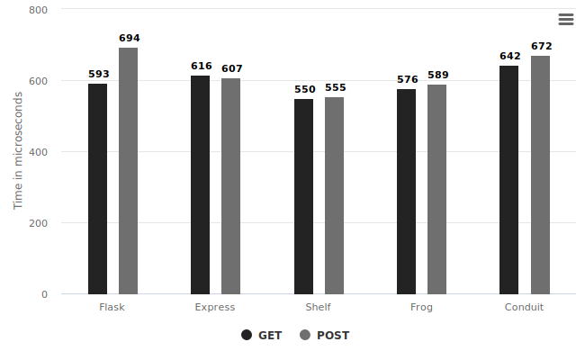
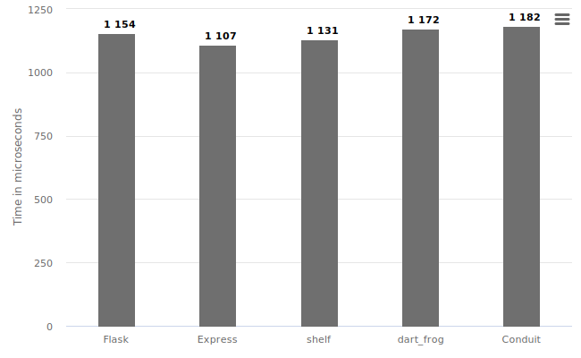
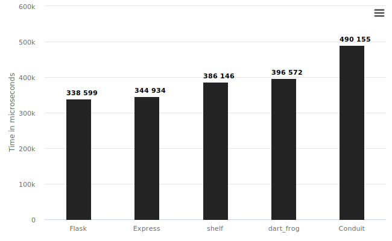
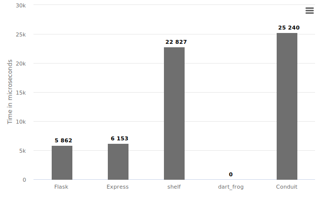
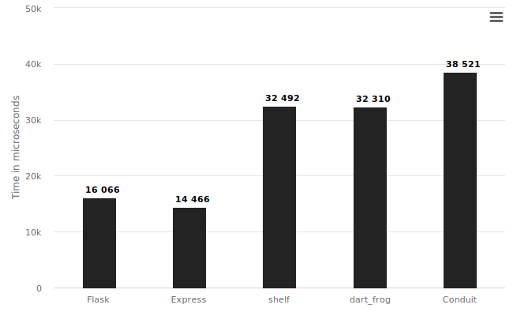

Hey everyone!

Some of you might be thinking "What is Dart?" - it is a strongly typed, object-oriented programming language developed by Google.

A lot of you might be confused if you can use Dart for the backend - Yes, you can write a backend server in almost all languages.

In this blog, I will talk about the benchmarks of [Flask (Python)](https://flask.palletsprojects.com/en/2.2.x/), [Express (JavaScript)](https://expressjs.com/), [Shelf (Dart)](https://pub.dev/packages/shelf), [dart_frog (Dart)](https://dartfrog.vgv.dev/) and [Conduit (Dart)](https://j4qfrost.gitbook.io/conduit/), and my opinions on Dart on the server side.

# Benchmarks

The code for the benchmarks is at [SirusCodes](https://github.com/SirusCodes/backend_benchmark)/backend_benchmark](https://github.com/SirusCodes/backend_benchmark). Please [open](https://github.com/SirusCodes/backend_benchmark/issues/new) an [issue](https://github.com/SirusCodes/backend_benchmark/issues/new) if you find any issues in the benchmarks.

I got the below results by running the benchmark and servers on an AWS t3a.small instance running Ubuntu 22.

The benchmarks are testing backends on 4 bases

1. Synchronous request handling
2. Asynchronous request handling
3. Multi-part requests (File upload)
4. JSON parsing

> Lesser means better

## Synchronous request handling

In this, the client sends a request to the server then waits for the response and then sends another.

The lowest time taken was by Shelf which is still comparable with other frameworks

## Asynchronous request handling

In this multiple requests are sent to the server and waits for all the responses back from the server.

### GET requests

The fastest one was ExpressJS but again with not a great margin.

### POST requests

Here Flask is the fastest and Dart servers perform a bit slower and conduit is the slowest of all.

## Multi-part requests (File upload)

The multipart requests are usually made to upload images to a server. In this, I'm sending requests synchronously.

The Dart servers are handling it very slowly. Flask and ExpressJS are killing it.

dart_frog doesn't support it yet, you can track the progress at [dart_frog#296](https://github.com/VeryGoodOpenSource/dart_frog/issues/296).

The Shelf also doesn't provide out-of-the-box support for it but I have used [shelf_multipart](https://pub.dev/packages/shelf_multipart) (a 3rd party package) to handle requests.

## JSON parsing

In this, I'm stress testing the speed of JSON parsing by frameworks. By sending 1.04MB of JSON data over POST request synchronously.

Again you can see Flask and express are twice as fast as Dart frameworks.

> In real world no one will be sending such huge chunks of JSON over the network but these are just for benchmark sake

---

By looking at the benchmarks we can say Dart servers have similar speeds when compared to other frameworks but there is a scope for improvement in multipart requests and in parsing high volumes of JSON data.

# Why should you care?

These Dart frameworks are pretty new and got some traction in recent years. They will grow and will be much better than now but it will take time.

| Frameworks | Release       |
| ---------- | ------------- |
| Flask      | April 2010    |
| Express    | November 2010 |
| Shelf      | April 2014    |
| dart_frog  | May 2022      |
| conduit    | April 2021    |

As you can see above these Dart frameworks competing with the grand old daddies of backend frameworks and still performing decent is a win for me.

Sure currently they are not the best but with time they will surely improve.

## Should you give Dart a try?

Absolutely Yes! Dart is a simple language with a very smooth learning curve.

If you like challenges then exploring the serverside of Dart will provide you with enough challenges as it's new and you will learn a lot along the way. I would recommend you use [shelf](https://pub.dev/packages/shelf)](https://pub.dev/packages/shelf) as it least abstracted framework of all.

It can be a good side project for you if you are already using Dart for Flutter then you can easily start building without any other dependencies.

Also, it can bring your Backend and Frontend (Flutter) in the same language.

The development in the Dart server space is very active. While developing for benchmarks I found a small [issue](https://github.com/VeryGoodOpenSource/dart_frog/issues/409) with dart_frog which got [fixed](https://github.com/VeryGoodOpenSource/dart_frog/pull/411/) in **a day**.

# My opinions

## What am I interested in?

[Serverpod](serverpod.dev) looks interesting as well. I liked the idea of having a lot of integration out of the box. _I tried to build it but it doesn't support windows yet🥲_

The [roadmap](https://dartfrog.vgv.dev/docs/roadmap) of dart_frog is pretty interesting. I'm looking forward to the client generation which is also supported by Serverpod.

## Production?

If you are trying to get something up and running quickly then I don't feel Dart is a good option here. As currently there are not easy cloud integrations and not so many resources to help you with any issues you face.

If it's a small side project with an expected user base of thousands then go ahead with Dart.

# Final words

Dart backend might not be the best option for production applications now but it’s a to thing keep an eye at.

> All the above charts are made with [copyicon.com](https://copyicon.com/)
