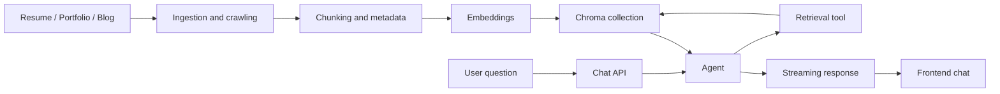

I built Wingman because there was too much AI chatter around me, and I wanted to actually build something instead of only reading threads.

I also wanted it live on my portfolio, not stuck as a local toy. If it is public, people can use it, and I am forced to keep quality high. That is how it ended up at [darshanrander.com/chat](https://darshanrander.com/chat).

And yes, I named it Wingman because I wanted a bot that can present my work clearly when I am not around to do it myself.

# TL;DR

Wingman is a personal RAG chatbot over my resume, portfolio, and blog. It ingests those sources, stores embeddings in Chroma, retrieves context at chat time, and streams responses back to the UI.

The interesting part is not that it works. The interesting part is the trade-offs I made to keep it usable on a portfolio site: tight retrieval, caching, and limits to stop token burn.

# Why I built it

I did try another AI project before this: a chatbot that took uploaded images and generated new images from prompts plus source images. I dropped it. I just was not motivated enough to push it to completion.

Wingman gave me a clearer reason to continue because it solved a real problem for me. Resume alone is too short. Portfolio is formal. Blog has depth. Together they represent me better than any one source.

I also had a practical constraint: I did not want visitors hitting "out of free tokens" on my own site. So "cheap" for this project was very literal.

# Architecture at a glance

The final shape is straightforward:

I did not build all of this at once. I first got ingestion and chat working end to end. Caching and other optimizations came later.

# Ingestion and chunking

I started by chunking everything in a token-based way. It worked, but blog answers were not very good. The model would miss structure in long posts.

That is when I changed strategy:

- Resume: parsed as a document, larger chunks with overlap.
- Portfolio: shallow crawl and heading-aware splitting.
- Blog: deeper crawl and section-aware chunking.

I did not run formal benchmarks. I validated by checking what got retrieved for real questions and whether answers improved.

One practical issue: the default crawler path was unreliable as it would often fail to go thwough the whole site and miss some content, so I wrote the crawler logic myself.

# Storage and retrieval

Initially I thought of using Postgres for storage, but I thought of using Chroma because it's designed for vector data (I know for this project it wouldn't matter but why not 🙃). Also I'm using Postgres to store the chats.

In Chroma, I kept two collections: one for primary knowledge and one for chat cache. Cache updates often, and I did not want that churn mixing with the stable source collection.

For models, I used Cloudflare Workers AI for both embeddings and generation. Main reason: cost and simplicity. One provider, tighter stack, fewer moving parts.

At query time, the flow is simple: retrieve top-k chunks, pass context to the model, generate response.

# Agent and memory behavior

Middleware is where many practical fixes live.

At first, tool calls could go above 10 calls for a single question. That was expensive and unnecessary. I added call limits to stop this.

I also added semantic caching early because the use case is predictable. People ask questions which I would suggest as a suggested question, not write one of their own.

Another decision I made: I did not add output guardrails after generation. I considered it, but skipped it because it adds cost and felt unnecessary for this project scope.

For long conversations, summarization and checkpointing help keep context under control. I use the framework behavior here rather than managing that manually.

# Streaming responses

There are two ways to stream responses: WebSockets and Server-Sent Events (SSE).

WebSockets did not feel justified here since I did not need two-way concurrent communication. Streaming one way was enough hence I went with SSE.

# What I learned

I initially assumed model chat sessions were stateful in some persistent way. Building this taught me the opposite: each request carries prior context again, plus other state. Once that clicked, a lot of design choices made sense.

The two hardest parts for me were ingestion and caching.

- Ingestion: I had to learn how to chunk and structure content for retrieval. It is not just about splitting text; it is about understanding the content and how it will be used.
- Caching: I had to understand the middleware API of LangGraph and also invalidate the cache when the source content changed.

# Cost and performance optimizations

1. Semantic cache for repeated questions. As it dropped the number of request made to the model which would have increased the cost and time.
2. Tool call limits to control runaway loops.
3. Since I owned all three data sources, I didn't have to pretend they were the same. The resume, portfolio, and blog are structured differently, so they ended up with different chunking strategies too.
4. Summarization for long threads so that context wouldn't explode.

# What I should have done

Looking back, I'd also spend more time evaluating retrieval quality instead of relying mostly on manual testing. I never built a formal benchmark set, which means I can't objectively compare chunking strategies today.

## Final thoughts

Wingman started as a learning project, but it became a real part of my site.

The biggest lesson for me: good RAG is less about "just embeddings" and more about chunking, retrieval behavior, and cost discipline. If those three are weak, the rest looks good only in demos.
